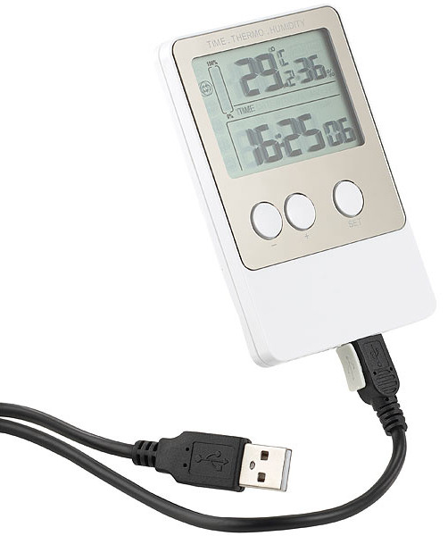

# freetecreader
Dies ist eine Quelloffene Lesesoftware für den [FreeTec/infactory NC7004 "USB-Temperatur- &amp; Luftfeuchtigkeits-Datenlogger V2"](http://www.free-tec.de/USB-Temperatur-NC-7004-919.shtml) von [Pearl](https://www.pearl.de/a-NC7004-3044.shtml).

Die offizielle Software für den NC7004 heißt "DataLogger3.3". Die Software verwendet eine Variante der "EasyWeather" Bibliothek.
Der NC7004 ist allerdings nicht protokollkompatibel mit den [populären WH1080 Wetterstationen](http://www.weewx.com/hwcmp.html).
Hilfreich war [dieses Blog](https://baublog.ozerov.de/2011/12/software-fuer-meine-wetterstation-wh1080) mit Hinweis auf das Projekt [weatherpoller](https://code.google.com/archive/p/weatherpoller) mit dem Verweis auf [Jim Easterbrook's Weather station memory map](http://www.jim-easterbrook.me.uk/weather/mm).

Getestet unter Linux mit Python 3.8.5 und hidapi 0.2.2.

Bitte beachten: Diese Software funktioniert zwar für das mir vorliegende Gerät, ich garantiere aber in keiner Weise für Zuverlässigkeit oder Korrektheit der Daten.

## Verwendung

Der Datenlogger wird als generisches HID-Gerät erkannt. Beim Abfragen der Daten wird das Gerät mit Befehlen beschrieben. Das muss nach dem Anschließen explizit mit `sudo chmod a+rw /dev/hidraw*` erlaubt werden. Das Setzen dieser Berechtigung kann [automatisiert](https://github.com/coldhand7/freetecreader/blob/master/99-hid_freetec_nc_7004.rules) werden.

    usage: freetecreader.py [-h] [--dump] [--csv] [--noindex] [--suffix SUFFIX]
                            [--data DATA] [--debug]

    optional arguments:
      -h, --help       show this help message and exit
      --dump           Dump raw binary to file
      --csv            Write interpreted csv to file
      --noindex        Do not write explicit index into csv
      --suffix SUFFIX  Suffix to add to output filenames
      --data DATA      Read raw binary dump
      --debug          Have debug output on stderr

Beispiel:

Der Befehl

    ./freetecreader.py --csv --suffix _$(date +%Y%m%d%a%H%M)

erzeugt im Arbeitsverzeichnis eine CSV mit der Gerätenummer und dem Datum, z.B. `7a2d743b_20201025So2105.csv`.
